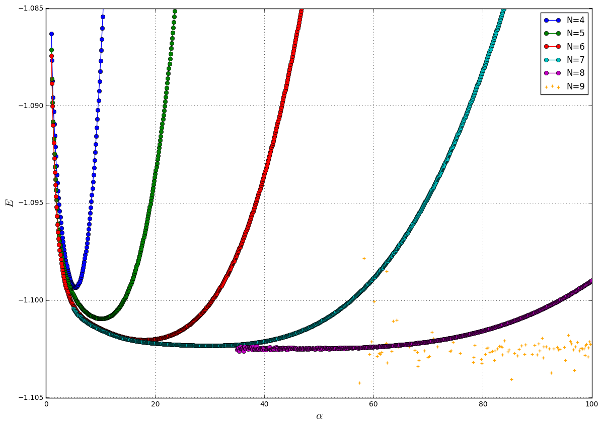

# Cząsteczka $H_2^{+}$


```python
from __future__ import division,print_function

import IPython,IPython.display

import numpy as np
import matplotlib.pyplot as plt

%matplotlib inline

import glob
import re

files = sorted(glob.glob('energies*.dat'))

IPython.display.display(IPython.display.Latex(r'Odpowiednio w kolejnych kolumnach: energia stanu podstawowego, różnica energii w porównaniu ze stanem podstawowym atomowego wodoru i $\alpha$ dla ktorego energia przyjmuje minimum.'))

plt.figure(figsize=[14.,10.])
plt.title('')
plt.xlabel(r'$\alpha$',fontsize=15)
plt.ylabel(r'$E$',fontsize=15)
plt.xlim([0.,100.])
plt.ylim([-1.105,-1.085])
plt.grid(True)

for f in files:
    data = np.loadtxt(f)
    
    N = int(float(re.findall(r'[-+]?\d+[\.]?\d*[eE]?[-+]?\d*',f)[0]))
    Emin = np.min(data[:,1])
    if (N<9):
        latex_input = r'N = {}'.format(N)+r'$\qquad min\left(E_{tot}(\alpha)\right)$'+ \
                      r': {:.5f} [Hartree]'.format(Emin+0.5)+r'$\qquad min(E_{tot})-E_0^{H}=$' + \
                      r'{:2f}[eV]'.format((Emin+1)*27.2114)+r'$\qquad \alpha:$'     + \
                      r' {:.1f}'.format(data[:,0][np.where(data[:,1] == Emin)][0])
        #print(latex_input)
        IPython.display.display(IPython.display.Latex(latex_input))
        plt.plot(data[:,0],data[:,1],marker='o',label='N={}'.format(N))
    if (N==9):
        plt.scatter(data[:,0],data[:,1],marker='+',label='N={}'.format(N),color='orange')
plt.legend(loc='best')
plt.show()
plt.close('all')
```


Odpowiednio w kolejnych kolumnach: energia stanu podstawowego, różnica energii w porównaniu ze stanem podstawowym atomowego wodoru i $\alpha$ dla ktorego energia przyjmuje minimum.


N = 4$\qquad min\left(E_{tot}(\alpha)\right)$: -0.59933 [Hartree]$\qquad min(E_{tot})-E_0^{H}=$-2.703005[eV]$\qquad \alpha:$ 5.4


N = 5$\qquad min\left(E_{tot}(\alpha)\right)$: -0.60094 [Hartree]$\qquad min(E_{tot})-E_0^{H}=$-2.746768[eV]$\qquad \alpha:$ 10.1


N = 6$\qquad min\left(E_{tot}(\alpha)\right)$: -0.60203 [Hartree]$\qquad min(E_{tot})-E_0^{H}=$-2.776512[eV]$\qquad \alpha:$ 18.0


N = 7$\qquad min\left(E_{tot}(\alpha)\right)$: -0.60233 [Hartree]$\qquad min(E_{tot})-E_0^{H}=$-2.784470[eV]$\qquad \alpha:$ 29.9


N = 8$\qquad min\left(E_{tot}(\alpha)\right)$: -0.60261 [Hartree]$\qquad min(E_{tot})-E_0^{H}=$-2.792144[eV]$\qquad \alpha:$ 36.2





Źródła:
<p>
http://www.physicspages.com/2014/01/16/hydrogen-molecule-ion/
</p>
http://farside.ph.utexas.edu/teaching/qmech/Quantum/node129.html
